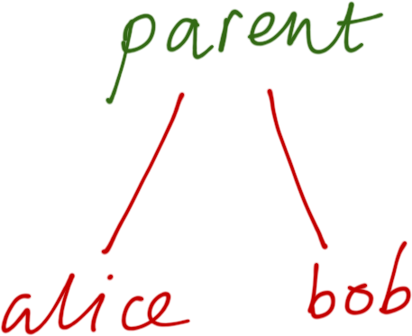
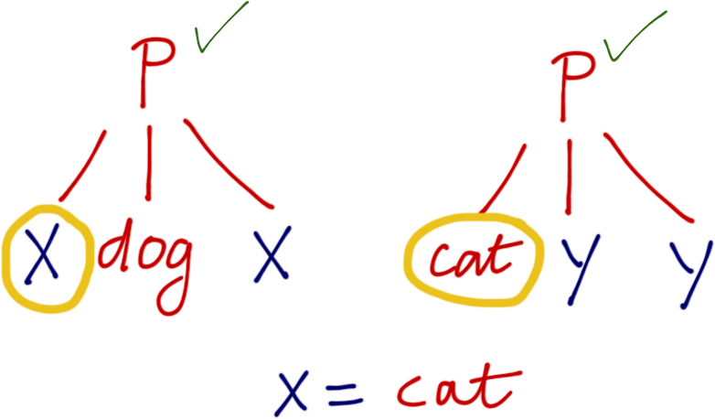
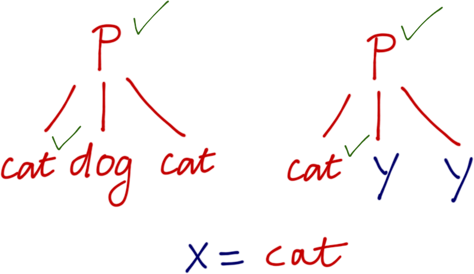
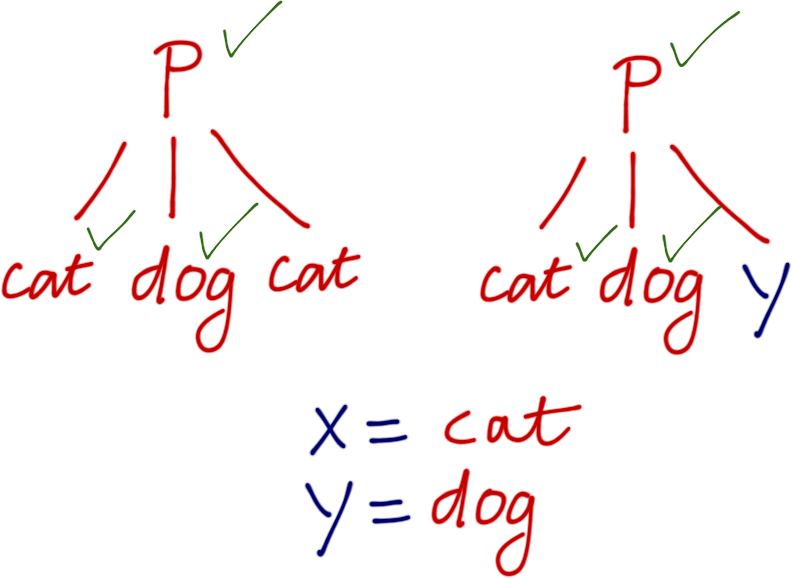
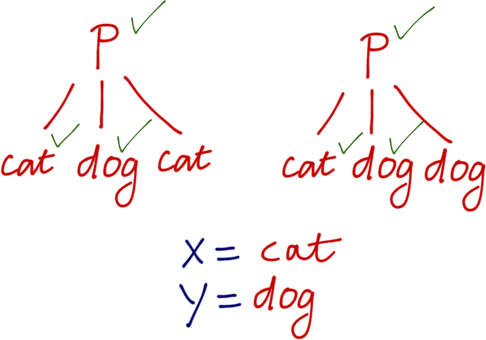

## News

- HW 5 is out, due Sun 6/11

## Logic Programming

### Traditional Languages

- **Program** = **Algorithm** + **Data Structures**

- **Execute**

### Prolog

- **Program** = **Facts** + **Rules**

- **Query**

## Logic Programming

{#fig:spock .align-center width=45%}

## Prolog History

- 1970s: Logic + Automated Theorem Proving

- Developed for **Artificial Intelligence**

## Prolog : Original Vision "Expert Systems"

### Collection of Facts

- *Carnitas is Mexican*           isMexican(carnitas)

### Collection of Rules

- *Mexican food is delicious*     if isMexican(X) then isDelicious(X)

### Queries

- *What is a delicious food ?*    hey! solve for Y. s.t. isDelicious(Y)

### Deductions

- *Carnitas!*

# You don't RUN Prolog, you ASK it QUESTIONS

## Declarative Programming

- Specify **what** you want

- Specify **desired properties** of result

- Not **how** to obtain result

# Declarative: Ideal for SEARCHING For Results

## Declarative Programming

Ideal for Searching Large Space of Results

### Philosophy

- It is often **hard**  to specify **search** algorithm

- But **easy** to specify the characteristics of the solution.

# Declarative Programming Examples...

## Declarative Programming: Orbitz/Expedia/etc.

### Collection of Facts

- Airports, Flights, Times, Durations, Costs

### Collection of Rules

- **If** travel from `A` to `B` with price (`P1`) **AND** `B` to `C` with price (`P2`)...

**Then**

- travel from `A` to `C` with price (`P1 + P2`) ...

### Queries

- What is cheapest flight from SAN to JFK with duration < 6 Hrs ?

## Declarative Programming: Linear Programming

### Collection of Facts

- **El Cuervo** makes CA Burrito (profit = `$2`), Fish Taco  (profit = `$1`)

### Collection of Rules

- Burrito Capacity < `200`
- Taco Capacity    < `400`
- Total Capacity   < `300`

### Query: How many burritos and tacos to **maximize** profit?

~~~~~{.scala}
max     2.burr + 1.taco       /* profit           */
s.t.    burr      <  200      /* burrito capacity */
        taco      < 400       /* taco    capacity */
        burr+taco < 300       /* total   capacity */
        0        <= burr
        0        <= taco      /* must produce!    */  
~~~~~

## Declarative Programming

Used heavily in many domains (together with statistical methods)

- Scheduling
   - Travel, Sports, ...

- Rule-based Anomaly detection
   - Credit card fraud!

- SQL (and similar DB Query Languages)
   - Find all pairs of stocks, with same price on same day,
   - More than 50 times last year

- Many of these are inspired-by / subsets of Prolog ...

# Prolog: New Way To Think About Programming ...

# Prolog: ... Programming As Proving!

## Plan

### Language

1. Terms
2. Facts
3. Queries (Implementation: Unification)
4. Rules
5. Programs (Implementation: Backtracking Search)

### Programming

- Numeric Computation
- Data Structures
- Puzzle Solving

## Language: Terms

Prolog Program

- **Facts**
- **Rules**

... but facts and rules **about what** ?

- Terms

## Terms are Prolog's way of representing Data

"Tree-like" values, similar to Ocaml ADTs

### Four Kinds of Terms

1. **Constants**

2. **Atoms**

3. **Variables**

4. **Compound Terms**

## Prolog Terms: Constants

**Constants** the simplest term, representing primitive values

- Basic types like integers, reals

- Examples: `1`, `92`, `4.4`  

## Prolog Terms: Atoms

**Atom:** any identifier starting with **lower**-case

- `x`, `alice`, `taco`, `giraffe`, `appleSauce`

# Atoms are NOT variables

## Prolog Terms: Atoms

**Atom:** any identifier starting with **lower**-case

- `x`, `alice`, `taco`, `giraffe`, `appleSauce`

### Atoms are not variables

- Elements of a single mega **enum** type

- Similar to tags used in ML types (except ML tags are uppercase)

- `type atoms = x | alice | taco | giraffe | appleSauce | ...`

## Prolog Terms: Atoms

**Atom:** any identifier starting with **lower**-case

- `x`, `alice`, `taco`, `giraffe`, `appleSauce`

### Atoms are Uninterpreted Constants (Names)

- Prolog knows **NOTHING** about the tags, they are just **names**

- Each tag is **equal to** itself (more later...)
   - `alice = alice`
   - `taco = taco`

- Each tag is **disequal to** every **other** tag
   - `alice = taco` **never** holds in Prolog

## Prolog Terms: Variables

**Variables:** any identifier starting with **upper**-case

- `X`, `Y`, `Z`, `Head`, `Tail`, `Taco`, `Burrito`, `Alice`, `Bob`

- `_` is the **wildcard** variable, similar to `ML`

### Variables are quite special ...

- Even though `x = a` makes **no sense** to Prolog ...

- ... `X = a` does have a meaning but **not** what you might think!

# Warning: Upper vs. Lowercase leads to errors

## Prolog Terms: Compound Terms

**Compound** terms are of form `atom(term1, term2, term3, ...)`

Where each `term` is **one-of**

- constant
- atom
- variable
- compound term

## Prolog Terms: Compound Terms

**Compound** terms are of form `atom(term1, term2, term3, ...)`

Where each `term` is **one-of**

- constant
- atom
- variable
- compound term

### Examples

~~~~~{.prolog}
x(y, z)              % y, z       are atoms
parent(alice, bob)   % alice, bob are atoms
parent(alice, Child) % alice is an atom, Child is a variable
~~~~~

# Prolog Terms ARE NOT function calls

## Prolog Compound Terms

- Terms are NOT Function Calls!

- More like **trees**

## Prolog Terms: Compound Terms

**Compound** terms are of form `atom(term1, term2, term3, ...)`

Each `term` is **one-of**

- constant
- atom
- variable
- compound term

### An Ocaml Type For Prolog Terms

~~~~~{.ocaml}
type term
  = Constant of int
  | Atom     of string
  | Variable of string
  | Compound of string * term list
~~~~~

## QUIZ: An Ocaml Type For Prolog Terms

~~~~~{.ocaml}
type term
  = Constant of int
  | Atom     of string
  | Variable of string
  | Compound of string * term list
~~~~~

(Hint: **atom** = lowercase, **variable** = uppercase)

Which **Ocaml** value of type `term` represents **Prolog** term

`parent(alice, bob)` ?

**A.** `parent ("alice", "bob")`

**B.** `parent (Atom "alice", Atom "bob")`

**C.** `[Atom "parent"; Atom "alice"; Atom "bob"]`

**D.** `Compound ("parent", [Atom "alice"; Atom "bob"])`

**E.** `Compound (Atom "parent", [Atom "alice"; Atom "bob"])`

## Prolog Compound Terms

Prolog term `parent(alice, Charlie)` is represented by:

### Ocaml Value

~~~~~{.ocaml}
Compound ("parent", [Atom "alice"; Var "Charlie"])
~~~~~

### Tree

## QUIZ: An Ocaml Type For Prolog Terms

~~~~~{.ocaml}
type term
  = Constant of int
  | Atom     of string
  | Variable of string
  | Compound of string * term list
~~~~~

(Hint: **atom** = lowercase, **variable** = uppercase)

What Ocaml value of type `term` represents Prolog term `factorial(5)` ?

**A.** `factorial(5)`

**B.** `factorial(Atom 5)`

**C.** `120`

**D.** `Constant 120`

**E.** `Compound ("factorial", [Constant 5])`

## Prolog Terms

Prolog term `factorial(5)` is simply the tree  

- The term is just a box containing `5` labeled `factorial`

### Function Symbols

- `factorial` just a **label** called a **function symbol**

- Prolog has **no idea** about **implementation** of function ...

# Prolog Terms = (Tree) Structured Data

## Plan

### Language

1. Terms
2. **Facts**
3. Queries (Implementation: Unification)
4. Rules
5. Programs (Implementation: Backtracking Search)

### Programming

- Numeric Computation
- Data Structures
- Puzzle Solving

# Language: Facts

## Language: Facts

### Example

The following facts specify a list of **parent-child** relationships

~~~~~{.prolog}
parent(kim, holly).  
parent(margaret, kim).  
parent(herbert, margaret).
parent(john, kim).
parent(felix, john).  
parent(albert, felix).
~~~~~

- **Note** `kim`, `holly`, `margaret` etc. are all **atoms**

- Facts are just terms (typically without variables.)

- Specified by term followed by `.`

### Prolog maintains a Database of facts

- You can make up and add new facts to the collection

- We will be able to ask Prolog **queries** over these facts

### Predicates = Function Symbols Used For Facts

- Represent functions that evaluate to a boolean

- e.g. `parent` is a predicate of **arity** 2 (that takes 2 arguments)

### Predicates Are Just Names: No Meaning Or Implementation

- `parent` is a predicate of **arity** 2 (that takes two arguments)

- Programmer **mentally** notes that:
    - `parent(kim, holly)`    **means** `kim` is a "parent-of" `holly`
    - `parent(margaret, kim)` **means** `margaret` is a "parent-of" `kim`
    - etc.

## Plan

### Language

1. Terms
2. Facts
3. **Queries** (Implementation: Unification)
4. Rules
5. Programs (Implementation: Backtracking Search)

### Programming

- Numeric Computation
- Data Structures
- Puzzle Solving

# Running Prolog via Queries

## Language: Queries

Standard interface is a REPL shell

~~~~~{.prolog}
$ rlwrap swipl

130f@ieng6-202]:~:501$ swipl
Welcome to SWI-Prolog (Multi-threaded, 32 bits, Version 5.10.5)
Copyright (c) 1990-2011 University of Amsterdam, VU Amsterdam
SWI-Prolog comes with ABSOLUTELY NO WARRANTY. This is free software,
and you are welcome to redistribute it under certain conditions.
Please visit http://www.swi-prolog.org for details.

For help, use ?- help(Topic). or ?- apropos(Word).

?-
~~~~~

## Language: Queries

Suppose we have a collection of facts saved in  [lec-prolog.pl](/lectures/lec-prolog.pl)

You can **load** the facts in ...

~~~~~{.prolog}
?- consult('lec-prolog.pl').
% foo.pl compiled 0.00 sec, 10,640 bytes
true.
~~~~~

... or you can **add** them one-at-a-time

~~~~~{.prolog}
?- assert(parent(margaret, kim)).
~~~~~

## Language: Queries

Once facts are loaded, you **query** Prolog as follows:

1. **Plg:** Prompts you to type a query

2. **You:** Type a query

3. **Plg:** Tries to *prove* your query

4. **Plg:** Prints out the result (or `failure`)

5. Repeat (go to 1)

# Lets ask some questions!

## Language: Queries

The simplest possible query ...

~~~~~{.prolog}
?- parent(margaret, john).  
~~~~~

... a **fact** but typed at the prompt.

## Language: Queries

The simplest possible query ...

~~~~~{.prolog}
?- parent(margaret, john).  
~~~~~

... a **fact** but typed at the prompt.

### Meaning

O Prolog, is this fact **in** your Database ... or can it be **inferred** from your database?

## Language: Queries

The simplest possible query ...

~~~~~{.prolog}
?- parent(margaret, john).  
~~~~~

... a **fact** but typed at the prompt.

### Meaning

O Prolog, is this fact **in** your database ... or can it be **inferred** from your database?

### Prolog Replies

~~~~~{.prolog}
?- parent(margaret, john).
false.
~~~~~

- This is **not** one of the facts we gave it, and,
- We are yet to supply it with **rules** for inferring **new facts**.

## Language: Queries

A slightly different query yields a different result.

## Language: Queries

A slightly different query yields a different result.

~~~~~{.prolog}
?- parent(margaret, kim).  
true.
~~~~~

- As this was indeed one of the facts loaded in [lec-prolog](/lectures/lec-prolog.pl)

# Pfft. Big deal? Is Prolog just a table lookup?!

# Things get more interesting when queries have variables ...

## Queries With Variables

This is where Prolog starts to depart radically from other paradigms...

~~~~~{.prolog}
?- parent(margaret, X).
~~~~~

 

### Meaning

O Prolog, for **which value(s)** of `X` is the fact **provable** ?

## Queries With Variables

This is where Prolog starts to depart radically from other paradigms...

~~~~~{.prolog}
?- parent(margaret, X).
~~~~~

 

### Meaning

O Prolog, for **which value(s)** of `X` is the fact **provable** ?

### Prolog Replies

~~~~~{.prolog}
X = kim.
~~~~~

As when prolog **plugs-in** `kim` for `X`,

- It can infer `parent(margaret, kim)`.

## Queries With Variables

Suppose we *flip* the query.

~~~~~{.prolog}
?- parent(X, kim).
~~~~~

O Prolog, for **which value(s)** of `X` is `parent(X, kim)` **provable** ?

## Queries With Variables

Suppose we *flip* the query.

~~~~~{.prolog}
?- parent(X, kim).
~~~~~

O Prolog, who are the **parents-of** `kim`?

## Queries With Variables

Suppose we *flip* the query.

~~~~~{.prolog}
?- parent(X, kim).
~~~~~

O Prolog, who are the **parents-of** `kim`?

### Prolog Replies

~~~~~{.prolog}
?- parent(X, kim).
X = margaret ; % [press ';' if you want another solution]
X = john ;     % [press ';' if you want another solution]
false.         % [thats all folks, no more solutions    ]
~~~~~

 

Returns **all solutions** for `X` that make `parent(X, kim)` provable.

## Queries With Variables

We can write queries with *multiple* variables.

~~~~~{.prolog}
?- parent(X, Y).
~~~~~

O Prolog, for which pairs `X`, `Y` is `parent(X, Y)` provable?

## Queries With Variables

We can write queries with *multiple* variables.

~~~~~{.prolog}
?- parent(X, Y).
~~~~~

O Prolog, for which pairs `X`, `Y` is `parent(X, Y)` provable?

### Prolog Replies

~~~~~{.prolog}
?- parent(X, Y).
X = kim,      Y = holly   ;
X = margaret, Y = kim     ;
X = herbert,  Y = margaret;
X = john,     Y = kim     ;
X = felix,    Y = john    ;
X = albert,   Y = felix   ;
X = albert,   Y = dana    ;
X = felix,    Y = maya    .
~~~~~

Enumerates **all facts** in the `parent` database.

## QUIZ: Queries With Variables

Suppose we want to know if there are any strange
circularities in the database:

> Does there exist **any** person who is their **own parent** ?

Which of the following encodes the above in Prolog?

**A.** `parent(kim, kim)`

**B.** `parent(x, x)`

**C.** `parent(X, X)`

**D.** `parent(X, Y)`

**E.** `parent(Y, X)`

# Queries are magic! 

## Queries Work Like Magic

In Java/C# or for that matter ML/Scala/... you would need

- Some `parentOf` or `childOf` methods
    - to represent parent-child relationship

- Some looping or iteration
    - to search through all pairs

- Instead, Prolog uses **facts** and **queries**
    - to search **forwards** and **backwards**
    - to enumerate all results
    - in a single uniform **declarative** manner!

# Magic = Unification + Backtracking Search

## Plan

### Language

1. Terms
2. Facts
3. Queries  (Implementation: **Unification**)
4. Rules
5. Programs (Implementation: Backtracking Search)

### Programming

- Numeric Computation
- Data Structures
- Puzzle Solving

# Unification: Prolog's **computational heart**

# Unification: When does one term MATCH another?

## Unification

### Two Terms Can Be Unified If

We can **substitute** values for their **variables** to make the terms **identical**

## Unification

### Two terms can be *unified* if we can *substitute* values for variables to make the terms *identical*

### Equality Is Unification

In Prolog, when you write (e.g. in a query)

~~~~~{.prolog}
?- term1 = term2.
~~~~~

you are asking whether `term1` **can be unified with** `term2`.

# Unification By Example

## Unification: Atoms

### Two terms can be *unified* if we can *substitute* values for variables to make the terms *identical*

### Example

~~~~~{.prolog}
?- kim = kim.
true.
~~~~~

Two **same atoms** are **trivially** unified.

## Unification: Atoms

### Two terms can be *unified* if we can *substitute* values for variables to make the terms *identical*

### Example

~~~~~{.prolog}
?- kim = holly.
false.
~~~~~

Two **different atoms** can **never** be unified.

## Unification: Compound Terms Are Recursively Unified

### Two terms can be *unified* if we can *substitute* values for variables to make the terms *identical*

### Example

~~~~~{.prolog}
?- foo(kim) = foo(kim).
true.
~~~~~

As there are no variables, and the terms **are already** identical.

### Example

~~~~~{.prolog}
?- foo(kim) = foo(holly).
false.
~~~~~

As there are no variables, and the terms **can never be** identical.

## Unification: Variables

### Two terms can be *unified* if we can *substitute* values for variables to make the terms *identical*

### Example

~~~~~{.prolog}
?- X = kim.
~~~~~

- **Q:** When is the term `X` **identical to** the term `kim`?

- **A:** When we **substitute** `X` with the value `kim`!

## Unification: Variables

### Two terms can be *unified* if we can *substitute* values for variables to make the terms *identical*

### Example

~~~~~{.prolog}
?- foo(X) = foo(kim).
~~~~~

- **Q:** When is the term `X` **identical to** the term `kim`?

- **A:** When we **substitute** `X` with the value `kim`!

### Prolog Responds

~~~~~{.prolog}
?- foo(X) = foo(kim).
X = kim.
~~~~~

- Pretty simple...

## QUIZ: Unification With Multiple Variables

### Two terms can be *unified* if we can *substitute* values for variables to make the terms *identical*

How does Prolog respond to the following query?

~~~~~{.prolog}
?- foo(X, dog) = foo(cat, Y).
~~~~~

**A.** `false`

**B.** `X = cat, Y = cat.`

**C.** `X = dog, Y = dog.`

**D.** `X = dog, Y = cat.`

**E.** `X = cat, Y = dog.`

## Unification With Multiple Variables

### Two terms can be *unified* if we can *substitute* values for variables to make the terms *identical*

~~~~~{.prolog}
?- p(X, dog, X) = p(cat, Y, Y).
~~~~~

## Unification With Multiple Variables

### Two terms can be *unified* if we can *substitute* values for variables to make the terms *identical*

~~~~~{.prolog}
?- p(X, dog, X) = p(cat, Y, Y).
~~~~~

The **top** nodes of both trees have **same predicate** ... go inside.

## Unification With Multiple Variables

### Two terms can be *unified* if we can *substitute* values for variables to make the terms *identical*

~~~~~{.prolog}
?- p(X, dog, X) = p(cat, Y, Y).
~~~~~

To unify `X` and `cat` use **substitution** `X = cat`

## Unification With Multiple Variables

### Two terms can be *unified* if we can *substitute* values for variables to make the terms *identical*

~~~~~{.prolog}
?- p(X, dog, X) = p(cat, Y, Y).
~~~~~

Apply substitution `X = cat` to both terms. Move on to next leaf...

## Unification With Multiple Variables

### Two terms can be *unified* if we can *substitute* values for variables to make the terms *identical*

~~~~~{.prolog}
?- p(X, dog, X) = p(cat, Y, Y).
~~~~~

To unify `dog` and `Y` use **substitution** `Y = dog` ...

## Unification With Multiple Variables

### Two terms can be *unified* if we can *substitute* values for variables to make the terms *identical*

~~~~~{.prolog}
?- p(X, dog, X) = p(cat, Y, Y).
~~~~~

... and apply substitution throughout **both** terms.

## Unification With Multiple Variables

### Two terms can be *unified* if we can *substitute* values for variables to make the terms *identical*

~~~~~{.prolog}
?- p(X, dog, X) = p(cat, Y, Y).
~~~~~

Uh oh, now last leaf has **different** atoms...

## Unification With Multiple Variables

### Two terms can be *unified* if we can *substitute* values for variables to make the terms *identical*

~~~~~{.prolog}
?- p(X, dog, X) = p(cat, Y, Y).
~~~~~

... impossible to unify `cat` and `dog`. **Unification fails.**

## Unification With Multiple Variables

### Two terms can be *unified* if we can *substitute* values for variables to make the terms *identical*

~~~~~{.prolog}
?- p(X, dog, X) = p(cat, Y, Y).
false.
~~~~~

## QUIZ: Recursively Unify Subtrees

### Two terms can be *unified* if we can *substitute* values for variables to make the terms *identical*

How does Prolog respond to the following unification query?

~~~~~{.prolog}
?- a(W, foo(W, Y), Y) = a(2, foo(X, 3), Z).
~~~~~

**A.** `false.` (No unification possible)

**B.** `W = 2, X = 2, Y = 2, Z = 2.`

**C.** `W = 2, X = 2, Y = 3, Z = 3.`

**D.** `W = 3, X = 3, Y = 2, Z = 2.`

**C.** `W = 2, X = 3, Y = 2, Z = 3.`

## Recursively Unify Subtrees

### Two terms can be *unified* if we can *substitute* values for variables to make the terms *identical*

How does Prolog respond to the following unification query?

~~~~~{.prolog}
?- a(W, foo(W, Y), Y) = a(2, foo(X, 3), Z).
~~~~~

1. Subst `W = 2`. Query is: `a(2, foo(2, Y), Y) = a(2, foo(X, 3), Z).`

2. Subst `X = 2`. Query is: `a(2, foo(2, Y), Y) = a(2, foo(2, 3), Z).`

3. Subst `Y = 3`. Query is: `a(2, foo(2, 3), 3) = a(2, foo(2, 3), Z).`

4. Subst `Z = 3`. Query is: `a(2, foo(2, 3), 3) = a(2, foo(2, 3), 3).`

5. **Done!**

## Recursively Unify Subtrees

### Two terms can be *unified* if we can *substitute* values for variables to make the terms *identical*

How does Prolog respond to the following unification query?

~~~~~{.prolog}
?- a(W, foo(W, Y), Y) = a(2, foo(X, 3), Z).
W = 2,
X = 2,
Y = 3,
Z = 3.
~~~~~

## QUIZ: Recursively Unify Subtrees

### Two terms can be *unified* if we can *substitute* values for variables to make the terms *identical*

How does Prolog respond to the following unification query?

~~~~~{.prolog}
?- a(W, foo(W, Y), Y) = a(2, foo(X, 3), X).
~~~~~

  

**A.** `false.` (No unification possible)

**B.** `W = 2, X = 2, Y = 2, Z = 2.`

**C.** `W = 2, X = 2, Y = 3, Z = 3.`

**D.** `W = 3, X = 3, Y = 2, Z = 2.`

**E.** `W = 2, X = 3, Y = 2, Z = 3.`

## Recursively Unify Subtrees

### Two terms can be *unified* if we can *substitute* values for variables to make the terms *identical*

How does Prolog respond to the following unification query?

~~~~~{.prolog}
?- a(W, foo(W, Y), Y) = a(2, foo(X, 3), X).
~~~~~

1. Subst `W = 2`. Query is: `a(2, foo(2, Y), Y) = a(2, foo(X, 3), X).`

2. Subst `X = 2`. Query is: `a(2, foo(2, Y), Y) = a(2, foo(2, 3), 2).`

3. Subst `Y = 3`. Query is: `a(2, foo(2, 3), 3) = a(2, foo(2, 3), 2).`

4. `3 = 2` cannot be unified, **Fail!**

# Unification: Powerful Way To Answer Queries

## Unification is a Powerful Way To Answer Queries

When we ask

~~~~~{.prolog}
?- parent(margaret, X).  
~~~~~

Prolog checks if the above term **can be unified** with any **known fact** (term).

- If **unification succeeds** then it replies `true`
    - And also the **unifying substitutions** for `X`
    - Which are the **solutions** for the query!

- If **unification fails** then it replies `false`

## Unification is a Powerful Way To Answer Queries

When we ask

~~~~~{.prolog}
?- parent(margaret, X).  
~~~~~

Prolog checks if the above term **can be unified** with any **known fact** (term).

- If **unification succeeds** then it replies `true` (and the **solutions** for `X`)
- If **unification fails** then it replies `false`

### Above Query Has **One Solution**

~~~~~{.prolog}
?- parent(margaret, X).  
X = kim.
~~~~~

## Unification is a Powerful Way To Answer Queries

When we ask

~~~~~{.prolog}
?- parent(X, kim).  
~~~~~

## Unification is a Powerful Way To Answer Queries

When we ask

~~~~~{.prolog}
?- parent(X, kim).  
~~~~~

Prolog checks if the above term **can be unified** with any **known fact** (term).

- If **unification succeeds** then it replies `true` (and the **solutions** for `X`)
- If **unification fails** then it replies `false`

## Unification is a Powerful Way To Answer Queries

When we ask

~~~~~{.prolog}
?- parent(X, kim).  
~~~~~

Prolog checks if the above term **can be unified** with any **known fact** (term).

- If **unification succeeds** then it replies `true` (and the **solutions** for `X`)
- If **unification fails** then it replies `false`

### This Query Has **Many Solutions**

~~~~~{.prolog}
?- parent(X, kim).  
X = margaret ;
X = john     .
~~~~~

## Unification is a Powerful Way To Answer Queries

Finally, when we ask

~~~~~{.prolog}
?- parent(X, Y).  
~~~~~

## Unification is a Powerful Way To Answer Queries

Finally, when we ask

~~~~~{.prolog}
?- parent(X, Y).  
~~~~~

Prolog checks if the above term **can be unified** with any **known fact** (term).

- If **unification succeeds** it replies `true` (and **solutions** for `X`, `Y`)
- If **unification fails** it replies `false`

## Unification is a Powerful Way To Answer Queries

Finally, when we ask

~~~~~{.prolog}
?- parent(X, Y).  
~~~~~

Prolog checks if the above term **can be unified** with any **known fact** (term).

- If **unification succeeds** it replies `true` (and **solutions** for `X`, `Y`)

### This Query Has **Many Solutions**: All known facts

~~~~~{.prolog}
?- parent(X, Y).
X = kim,      Y = holly   ;
X = margaret, Y = kim     ;
X = herbert,  Y = margaret;
X = john,     Y = kim     ;
X = felix,    Y = john    ;
X = albert,   Y = felix   ;
X = albert,   Y = dana    ;
X = felix,    Y = maya    .
~~~~~

# Unification Lets Prolog Answer Queries Magically!

## Plan

### Language

1. Terms
2. Facts
3. Queries  (Implementation: Unification)
4. **Rules**
5. Programs (Implementation: Backtracking Search)

### Programming

- Numeric Computation
- Data Structures
- Puzzle Solving

# Rules

# Digression: Conjunctions, Queries about MANY terms

## Conjunction: Comma-separated Sequence of terms

Often useful to ask questions over **multiple** terms.

- For example, to determine if `margaret` is the **grandparent** of `holly`

## Conjunction: Comma-separated Sequence of terms

Often useful to ask questions over **multiple** terms.

- For example, to determine if `margaret` is the **grandparent** of `holly`

~~~~~{.prolog}
?- parent(margaret, X), parent(X, holly).
~~~~~

- Is there a person `X` who is a child of `margaret` **AND** a parent of `holly` ?

- Is there `X` s.t. `parent(margaret, X)` **AND** `parent(X, holly)` ?

## Conjunction: Comma-separated Sequence of terms

Often useful to ask questions over **multiple** terms.

- For example, to determine if `margaret` is the **grandparent** of `holly`

~~~~~{.prolog}
?- parent(margaret, X), parent(X, holly).
~~~~~

- Is there a person `X` who is a child of `margaret` **AND** a parent of `holly` ?

- Is there `X` s.t. `parent(margaret, X)` **AND** `parent(X, holly)` ?

### Apparently

~~~~~{.prolog}
?- parent(margaret, X), parent(X, holly).
X = kim.
~~~~~

## Conjunction: Comma-separated Sequence of terms

Often useful to ask questions over **multiple** terms.

- For example, to find the **great-grandparents** of `kim`

## Conjunction: Comma-separated Sequence of terms

Often useful to ask questions over **multiple** terms.

- For example, to find the **great-grandparents** of `kim`

~~~~~{.prolog}
?- parent(GGP, GP), parent(GP, P), parent(P, kim).
~~~~~

**Note:** how we link the terms with a variable to capture relationships.

## Conjunction: Comma-separated Sequence of terms

Often useful to ask questions over **multiple** terms.

- For example, to find the **great-grandparents** of `kim`

~~~~~{.prolog}
?- parent(GGP, GP), parent(GP, P), parent(P, kim).
~~~~~

**Note:** how we link the terms with a variable to capture relationships.

Prolog finds appropriate **unifiers** and replies

~~~~~{.prolog}
?- parent(margaret, X), parent(X, holly).
GGP = john,
GP  = felix,
P   = albert.
~~~~~

i.e. `john` is a **great-grandparent** following the above chain.

## QUIZ: Conjunctions

Which of these queries is true iff `margaret` and `kim` are (half-) **siblings**?

**A.** `parent(margaret, kim)`

**B.** `parent(margaret, X), parent(X, kim).`

**C.** `parent(kim, X), parent(X, margaret).`

**D.** `parent(margaret, X), parent(kim, X).`

**E.** `parent(X, margaret), parent(X, kim).`

## Recap: Conjunctions

- Conjunctions let us mine the database for complex relationships...

- ... but its cumbersome to **repeatedly** write down long queries

- We need a way to **compose** complex queries from simple queries...

# Rules

## Rules: Complex Predicates from Simple Queries

### Format

~~~~~{.prolog}
headQuery :- condQuery1, condQuery2, condQuery3,...
~~~~~

## Rules: Complex Predicates from Simple Queries

### Format

~~~~~{.prolog}
headQuery :- condQuery1, condQuery2, condQuery3,...
~~~~~

  

### Intuition 1 (Forwards)

- **If** you can prove `condQuery1` **AND** `condQuery2` **AND** `...`

- **Then** you can prove `headQuery`

## Rules: Complex Predicates from Simple Queries

### Format

~~~~~{.prolog}
headQuery :- condQuery1, condQuery2, condQuery3,...
~~~~~

  

### Intuition 2 (Backwards)

- To prove the **goal** `headQuery` ...

- Prove **subgoals** `condQuery1` **AND** `condQuery2` **AND** ...

## Rules: Complex Predicates from Simple Queries

### An Example: Defining a `grandparent` predicate

- Our database includes a `parent` predicate

- Let us use it to **define** a `grandparent` predicate

## Rules: Complex Predicates from Simple Queries

### An Example: Defining a `grandparent` predicate

~~~~~{.prolog}
grandparent(GP, GC) :- parent(GP, P), parent(P, GC).
~~~~~

 

### Intuition

`GP` is a *grandparent* of `GC` if `GP` is a *parent* of `P` **and** `P` is a *parent* of `GC`

## Rules: Complex Predicates from Simple Queries

### An Example: Defining a `grandparent` predicate

~~~~~{.prolog}
grandparent(GP, GC) :- parent(GP, P), parent(P, GC).
~~~~~

### Querying The Defined Predicate

~~~~~{.prolog}
?- grandparent(X, kim). % who are the grandparents of kim
X = herbert ;           % hit ; to see next
X = felix   ;           % hit ; to see next
false.                  % thats it!
~~~~~

## Rules: Complex Predicates from Simple Queries

### An Example: Defining a `grandparent` predicate

~~~~~{.prolog}
grandparent(GP, GC) :- parent(GP, P), parent(P, GC).
~~~~~

### Querying The Defined Predicate

~~~~~{.prolog}
?- grandparent(X, kim). % who are the grandparents of kim
X = herbert ;           % hit ; to see next
X = felix   ;           % hit ; to see next
false.                  % thats it!
~~~~~

### How? Because Prolog can prove

~~~~~{.prolog}
?- parent(herbert, P), parent(P, kim).  %% Solution 1. X = herbert
P = margaret.

?- parent(felix, P), parent(P, kim).    %% Solution 2. X = felix
P = john .
~~~~~

## QUIZ: Complex Predicates from Simple Queries

Which of the following is a valid `greatgrandparent` predicate?

(Btw, **greatgrandparent** is the  **parent** of a **grandparent**.)

bob -> sachin -> krishna -> ranjit

~~~~~{.prolog}
% A
greatgrandparent(X, Y) :- parent(X, Y), grandparent(X, Y).

% B
greatgrandparent(X, Y) :- parent(X, Z), grandparent(Z, Y).

% C
greatgrandparent(X, Y) :- grandparent(X, Z), parent(Z, Y).

% D
greatgrandparent(X, Y) :- parent(X, Z), parent(Z, Y).

% E  
greatgrandparent(X, Y) :- parent(X, Z), parent(Z, Z1), parent(Z1, Y).
~~~~~

anc(albert,DESC)
  parent(albert, felix) ==> anc(felix, DESC)
  parent(albert, dana)  ==> anc(dana, DESC)

anc(X, Y) :- anc(Z1, Y), parent(X, Z1).

anc(albert,DESC)
  anc(Z1, DESC)
    anc(Z1', DESC)
      anc(Z1'', DESC)
        anc(Z1''', DESC)

## Rules: Complex Predicates from Simple Queries

### An Example: Defining a `greatgrandparent` predicate

~~~~~{.prolog}
greatgrandparent(GGP, GC) :- parent(GGP, GP), grandparent(GP, GC).
~~~~~

## Rules: Complex Predicates from Simple Queries

### An Example: Defining a `greatgrandparent` predicate

~~~~~{.prolog}
greatgrandparent(GGP, GC) :- parent(GGP, GP), grandparent(GP, GC).
~~~~~

### Querying The Defined Predicate

~~~~~{.prolog}
?- greatgrandparent(X, holly).
X = herbert.
~~~~~

# That was our first Prolog program!

## Plan

### Language

1. Terms
2. Facts
3. Queries  (Implementation: Unification)
4. Rules
5. **Programs** (Implementation: Backtracking Search)

### Programming

- Numeric Computation
- Data Structures
- Puzzle Solving

# Prolog Programs = Facts + Rules!

## Prolog Programs = Facts + Rules!

Facts and Rules are two kinds of **clauses**

- **Fact:** Clause **without** any conditions

- **Rules:** Clause **with** conditions

### Programs

- Basic Facts / Predicates

- Rules for **generating** new Facts / Predicates

## Prolog Programs = Facts + Rules!

Complex Programs need Complex Predicates with Multiple Rules

1. Scope

2. Multiple Rules: Disjunction

3. Multiple Rules: Recursion

## Prolog Programs = Facts + Rules!

Complex Programs need Complex Predicates with Multiple Rules

1. **Scope**

2. Multiple Rules: Disjunction

3. Multiple Rules: Recursion

## Programs = Facts + Rules : Scope

A word about **scope**.

In the `grandparent` rule, the variable `GP` appears **twice**

~~~~~{.prolog}
greatgrandparent(GGP, GC) :- parent(GGP, GP), grandparent(GP, GC).
~~~~~

### Scope: All Variables Are Local To A Single Rule

- In Prolog, the scope of a variable is the **single** rule containing it.

- There is **no connection** between variables **across**  rules.

## Programs = Facts + Rules : Scope

A word about **scope**.

### Scope: All Variables Are Local To A Single Rule

- In Prolog, the scope of a variable is the **single** rule containing it.

- There is **no connection** between variables **across**  rules.

### Example

~~~~~{.prolog}
foo(P)   :- bar(P).     % There is no connection between P
stuff(P) :- thing(P).   % across the two rules
~~~~~

## Prolog Programs = Facts + Rules!

Complex Programs need Complex Predicates with Multiple Rules

1. Scope

2. **Multiple Rules: Disjunction**

3. Multiple Rules: Recursion

## Complex Predicates: Disjunction

Lets write a predicate `has_family` which is true for persons who

- **either** have a parent

- **or** have a child

## Complex Predicates: Disjunction

Lets write a predicate `has_family` which is true for persons who

- **either** have a parent

- **or** have a child

~~~~~{.prolog}
has_family(X) :- parent(X, _). % if X is the parent of some _
has_family(X) :- parent(_, X). % if X is the child of some _
~~~~~

`_` is a *wildcard* or *dont-care* variable (as in ML, Scala)

### Disjunction via Multiple Rules

- **If** we can prove `parent(X, _)` **Then** we can prove `has_family(X)`

- **If** we can prove `parent(_, X)` **Then** we can prove `has_family(X)`

## Complex Predicates: Disjunction

Lets write a predicate `has_family` which is true for persons who

- **either** have a parent

- **or** have a child

~~~~~{.prolog}
has_family(X) :- parent(X, _). % if X is the parent of some _
has_family(X) :- parent(_, X). % if X is the child of some _
~~~~~

### Executing the Query

~~~~~{.prolog}
?- has_family(holly).
true.  % Second rule fires for holly

?- has_family(mugatu).
false. % Neither rule fires for mugatu
~~~~~

## Complex Predicates: Disjunction

Lets write a predicate `has_family` which is true for persons who

- **either** have a parent

- **or** have a child

~~~~~{.prolog}
has_family(X) :- parent(X, _). % if X is the parent of some _
has_family(X) :- parent(_, X). % if X is the child of some _
~~~~~

Can be abbreviated to

~~~~~{.prolog}
has_family(X) :- parent(X, _) ; parent(_, X).
~~~~~

Semicolon `;` indicates disjunction.

## Prolog Programs = Facts + Rules!

Complex Programs need Complex Predicates with Multiple Rules

1. Scope

2. Multiple Rules: Disjunction

3. **Multiple Rules: Recursion**

## Complex Predicates: Recursion

Lets write a predicate `ancestor(Anc, Child)` which is true if

- `parent(Anc, Child)` ... **or**

- `parent(Anc, P)` and `parent(P, Child)` ... **or**

- `parent(Anc, GP)` and `parent(GP, P)` and `parent(P, Child)` ... **or**

- ... if **some** chain of parent-links holds between `Anc` and `Child`.

## Complex Predicates: Recursion

Lets write a predicate `ancestor(Anc, Child)` which is true if

... if **some** chain of parent-links holds between `Anc` and `Child`.

### Base Case

- If `Anc` is the parent of `Child`

- `ancestor(Anc, Child) :- parent(Anc, Child).`

### Inductive Case

- If `P` is the parent of `Child` and `Anc` is an **ancestor** of `P`

- `ancestor(Anc, Child) :- parent(P, Child), ancestor(Anc, P).`

## Complex Predicates: Recursion

Lets write a predicate `ancestor(Anc, Child)` which is true if

... if **some** chain of parent-links holds between `Anc` and `Child`.

~~~~~{.prolog}
ancestor(Anc, Child) :- parent(Anc, Child).
ancestor(Anc, Child) :- parent(P, Child), ancestor(Anc, P).
~~~~~

## Complex Predicates: Recursion

Lets write a predicate `ancestor(Anc, Child)` which is true if

... if **some** chain of parent-links holds between `Anc` and `Child`.

~~~~~{.prolog}
ancestor(Anc, Child) :- parent(Anc, Child).
ancestor(Anc, Child) :- parent(P, Child), ancestor(Anc, P).
~~~~~

Lets take it out for a spin!

First, lets find **descendants** (forwards)

~~~~~{.prolog}
?- ancestor(kim, X).
X = holly.
~~~~~

## Complex Predicates: Recursion

Lets write a predicate `ancestor(Anc, Child)` which is true if

... if **some** chain of parent-links holds between `Anc` and `Child`.

~~~~~{.prolog}
ancestor(Anc, Child) :- parent(Anc, Child).
ancestor(Anc, Child) :- parent(P, Child), ancestor(Anc, P).
~~~~~

Lets take it out for a spin!

Next, lets find **ancestors** (backwards)

~~~~~{.prolog}
?- ancestor(X,kim).
X = margaret  ;
X = john      ;
X = herbert   ;
X = felix     ;
X = albert    .
~~~~~

`kim` has a long ancestry!

# Pretty neat: go forward or back, in just 2 lines...

# ...Try doing that in any other language!

## Plan

### Language

1. Terms
2. Facts
3. Queries  (Implementation: Unification)
4. Rules
5. Programs (Implementation: **Backtracking Search**)

################################################################################
################################################################################
################################################################################

### Backtracking Search

TBD

### Order Matters!

TBD

### Language

1. Terms
2. Facts
3. Queries  (Implementation: Unification)
4. Rules
5. **Programs** (Implementation: Backtracking)

### Programming

- **Numeric Computation**
- Data Structures
- Puzzle Solving

### Backtracking Search

How does prolog answer recursive queries?

- Brute force *backtracking search*

View each clause as a **proof rule**:

~~~~~{.prolog}
goal :- subgoal_1, subgoal_2,...
~~~~~

Thus, the rules for ancestor are as follows:

~~~~~{.prolog}
ancestor(X,Y) :- parent(X,Y).			%rule 1
ancestor(X,Y) :- parent(Z,Y),ancestor(X,Z).	%rule 2
~~~~~

To prolog, these rules mean "to prove `ancestor(X,Y)`, try to:

1. Prove the *subgoal* `parent(X,Y)`, or, **failing that**,
2. Prove the *subgoal* `parent(X,Z), **and then** the subgoal `ancestor(X,Z)`.

Suppose we ask it the query:

~~~~~{.prolog}
?- ancestor(felix,holly).
~~~~~

To prove this query, it undertakes the following backtracking search:

- **NOTE** there are multiple `Z` variables (`Z'` and `Z''` ...)
- These are introduced each time the corresponding sub-goals are triggered.

~~~~~
		ancestor(felix,holly)?
		  /		                \
  parent(felix,holly)    parent(Z,holly)
	  NO		               ancestor(felix,Z)
				|
				| Z = kim  (by fact)
				|
			  ancestor(felix,kim)
			  /                \
	  parent(felix,kim)     parent(Z',kim)
	      NO                ancestor(felix,Z')  ----------|
			                     |                            | Z'=john
		           Z'=margaret |                            |
				          |                             ancestor(felix,john)
		      ancestor(felix,margaret)                      |
		              /        \                      parent(felix,john)
	parent(felix,margaret)   parent(Z'',margaret)         YES
		          NO           ancestor(felix,Z'')
                                      |
		                    Z'' = herbert |
		                                  |
			                  ancestor(felix, herbert)
			                 /              |
		 parent(felix,herbert)   parent(Z''',herbert)
		            NO			             NO
~~~~~

### Queries with Variables

*Backtracking Search* is done for **every** query.

~~~~~{.prolog}
  ?- ancestor(X,kim).
~~~~~

- Prolog does the proof search
- Returns **all** unifiers for `X` for which the proof succeeds with `YES`.

That is, literally programming by proving.

**Hint:** Trace mode in prolog shows the tree:

~~~~~{.prolog}
?- trace.
?- help(trace).
~~~~~

The subsequent query is traced...

### Order is Very Important!

- Order of clauses & terms influences unification & backtracking.

For each

- **goal** different clauses are selected in order,
- **clause** subgoals unified from **left-to-right**.

### Bad Order Causes Non-Termination!

So, different orders of recursive sub-query can cause **non-termination**

Suppose we wrote:

~~~~~{.prolog}
ancestor(X,Y) :- ancestor(X,Z), parent(Z,Y).
ancestor(X,Y) :- parent(X,Y).
~~~~~

Then we see:

~~~~~{.prolog}
    ?- ancestor(felix,holly).
~~~~~

Why? The search tree looks like this now!

~~~~~
		ancestor(felix,holly)?
		  |
			|
			|
		ancestor(felix,Z)  %prove first subgoal,
			|          %then parent(Z,holly)
			|
			|
		ancestor(felix,Z') %prove first subgoal,
			|	   %then parent(Z',Z)
			|
			|
		ancestor(felix,Z'')
			.
			.
			.
~~~~~~

### To Avoid Stack Overflow

- Place the `parent` subgoal **first** (in the recursive rule).

- Then unification with the base facts (parent), **fixes** `Z`

- Thereby guaranteeing termination.

### QUIZ

Which of these will terminate?

~~~~~{.prolog}
% A
ancestor(X,Y) :- ancestor(X,Z), parent(Z,Y).
ancestor(X,Y) :- parent(X,Y).

% B
ancestor(X,Y) :- parent(X,Y).
ancestor(X,Y) :- ancestor(X,Z), parent(Z,Y).

% C
ancestor(X,Y) :- parent(X,Y).
ancestor(X,Y) :- parent(Z,Y), ancestor(X,Z).

% D
ancestor(X,Y) :- parent(Z,Y), ancestor(X,Z).
ancestor(X,Y) :- parent(X,Y).
~~~~~

### QUIZ

Lets define a `sibling` predicate:

- `sibling(X, Y)` if `X` and `Y` have the same `parent`.

~~~~~{.prolog}
% A
sibling(X, Y) :- parent(P, X), parent(P, Y).

% B
sibling(X, Y) :- parent(P, X), parent(P, Y), not(X = Y).

% C
sibling(X, Y) :- not(X = Y), parent(P, X), parent(P, Y).
~~~~~

### Ordering and Unification

Unfortunately to `prolog`

~~~~~{.prolog}
?- X = Y.
X = Y
~~~~~

is **always true**, and so the `not` **always fails**

~~~~~{.prolog}
?- not(X = Y).
false.
~~~~~

So the following query **always fails**

- if `X` and `Y` are variables!

~~~~~{.prolog}
sibling(X, Y) :- not(X = Y), parent(P, X), parent(P, Y).
~~~~~

### Ensure Disequality Check After Unification

**Solution**

- Ensure goal `not(X=Y)` fires **after** `X` and `Y` are **unified to atoms**

~~~~~{.prolog}
sibling(X, Y) :- parent(P, X), parent(P, Y), not(X = Y).
~~~~~

and now we get:

~~~~~{.prolog}
    ?- sibling(X,Y).
    X = john
    Y = maya ;

    X = felix
    Y = dana ;

    X = dana
    Y = felix ;

    X = maya
    Y = john ;
    No
~~~~~

## Programming

Next, lets do some _programmaing_ in prolog.

- **Numeric Computation**
- Data Structures
- Puzzle Solving

### Numeric Computation

Two big problems:

1. How do we even *evaluate*? e.g. `2 + 3` ?

2. How do we write **functions** e.g. `let add x y = x + y` ?

### Problem 1: How to Evaluate?

- Everything is a _term_ and `=` is a **unification** operator:

~~~~~{.prolog}
?- X = 2 + 3.
X = 2 + 3
~~~~~

- Pfft. To "compute" we need some **evaluation** mechanism!

### Evaluation with the `is` Operator

The `is` operator lets us **evaluate** terms:

~~~~~{.prolog}
?- X is 2 + 3.
X = 5.
~~~~~

To solve `is` goal `TERM1 is TERM2`, prolog:

1. **Evaluates* `TERM2` and _then_
2. **Unifies** result with `TERM1`.

However, watch out!

~~~~~{.prolog}
?- Y is X+2, X=1.
ERROR: Args are not sufficiently instantiated

?- X=1, Y is X+2.
X=1
Y=3
~~~~~

- Variables must solved to numbers **before** evaluation.

- **Order of evaluation matters!**

### Numeric Computation

Two big problems:

1. How do we even *evaluate*? e.g. `2 + 1` ?

2. How do we write **functions** e.g. `let incr x = x + 1` ?

### Problem 2: How to Write Functions?

Oops. **Everything is a predicate** in prolog!

- Facts are the basic predicates, and
- Rules let us get new facts from the basic ones.

How can we even _represent_ a **function** e.g.

~~~~~{.ocaml}
let add x y = x + y
~~~~~

using predicates?

### QUIZ

Which of the following represents `let add x y = x + y`?

~~~~~{.prolog}
% A
addP(X, Y) :- Z is X + Y.         % wtf is Z ?

% B
addP(X, Y, Z) :- Z is X + Y.      % wtf is Z ?

% C
addP(X, Y, X + Y).

% D
addP(X, Y) :- X + Y.

% E
addP(X, Y, Z) :- X + Y is Z.
~~~~~

### Functions as Predicates

Every **function** of the form:

~~~~~{.ocaml}
let foo x y = out
~~~~~

corresponds to a **predicate** of the form:

~~~~~{.ocaml}
fooP(X, Y, OUT).
~~~~~

i.e. a predicate that is `True` for those triples `(X, Y, OUT)` s.t.

- The function `foo X Y` evaluated to `OUT`!

The `predicate` captures the **input-output relation** of the function.

### Factorial

Lets write a predicate capturing the IO relationship of `factorial`:

~~~~~{.prolog}
factorial(X, OUT)
~~~~~

holds only when `OUT` is the factorial of `X`.

~~~~~{.prolog}
**DO IN CLASS**
~~~~~

When we are done, we can **call** the function with a query:

~~~~~{.prolog}
	?- factorial(0, OUT).
	OUT = 1

	?- factorial(5, OUT).
	OUT = 120
~~~~~

### Programming

- Numeric Computation
- **Data Structures**
- Puzzle Solving

### Data Structures: Lists

TBD

### Programming

- Numeric Computation
- Data Structures
- **Puzzle Solving**

### Data Structures: Accumulators

TBD

### Puzzle Solving

- Towers of Hanoi
- Farmer, Wolf, Goat, Cabbage

### Towers of Hanoi

TBD

### Farmer, Wolf, Goat, Cabbage

TBD
